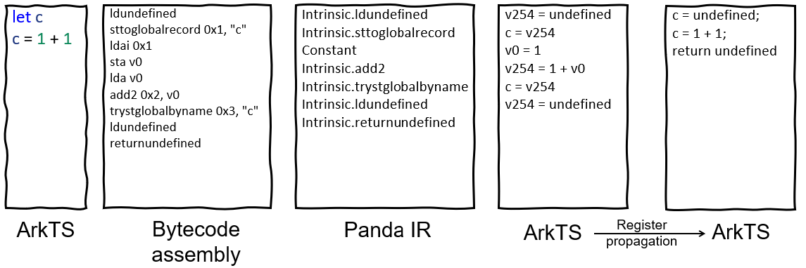

# Description
We developed the HarmonyOS NEXT decompilation tool named arkdecompiler, which takes Panda Binary File as input, parses Panda Bytecode, and then translates it into Panda IR. After having IR, we can do various analyses. Based on IR, we reversely construct the native arkTS AST tree, and then we traverse the AST tree and translate it into native arkTS source code.


- [2025 Black Hat, USA](https://www.blackhat.com/us-25/arsenal/schedule/index.html#decompiler-for-harmonyos-next-45569)
- [2026 Black Hat, ASIA](https://blackhat.com/asia-26/arsenal/schedule/index.html)
- 2026.Q1: Support all instructions and program structures

# Installation
## Tested platform
Ubuntu 22.04

In the future we will adapt to other development platforms such as (windows, macOS) and add a GUI.
## Prepare environment
```bash
run scripts/prepare.sh
```

## Clone arkdecompiler in HarmonyOS
```bash
cd harmonyos && git clone https://github.com/jd-opensource/arkdecompiler.git
```


## Apply patches to arkcompiler and third_party
Apply patches to `harmonyos/arkcompiler/runtime_core`, `harmonyos/arkcompiler/ets_frontend`, and `harmonyos/third_party/protobuf` according to the `patches`.


## Usage
### Build the decompilation main program `xabc`
```bash
./build.sh
```

### Prepare the source code file
Create `demo.ts`(refer `tests` directory)

### Compilation && Decompilation
./run.sh

#### detailed description
- The compilation result is：**demo.abc**(created by `genlogs.sh`)
- The decompilation result is：**arkdemo.ts**


## Demo
### Decompile bytecode to arkTS


### AST
```
{
  "type": "Program",
  "statements": [
    {
      "type": "ExpressionStatement",
      "expression": {
        "type": "AssignmentExpression",
        "operator": "=",
        "left": {
          "type": "Identifier",
          "name": "v254",
          "loc": {
            "start": {
              "line": 1,
              "column": 1
            },
            "end": {
              "line": 1,
              "column": 1
            }
          }
        },
        "right": {
          "type": "Identifier",
          "name": "undefined",
          "loc": {
            "start": {
              "line": 1,
              "column": 1
            },
            "end": {
              "line": 1,
              "column": 1
            }
          }
        },
        "loc": {
          "start": {
            "line": 1,
            "column": 1
          },
          "end": {
            "line": 1,
            "column": 1
          }
        }
      },
      "loc": {
        "start": {
          "line": 1,
          "column": 1
        },
        "end": {
          "line": 1,
          "column": 1
        }
      }
    },
    {
      "type": "ExpressionStatement",
      "expression": {
        "type": "AssignmentExpression",
        "operator": "=",
        "left": {
          "type": "Identifier",
          "name": "c",
          "loc": {
            "start": {
              "line": 1,
              "column": 1
            },
            "end": {
              "line": 1,
              "column": 1
            }
          }
        },
        "right": {
          "type": "Identifier",
          "name": "v254",
          "loc": {
            "start": {
              "line": 1,
              "column": 1
            },
            "end": {
              "line": 1,
              "column": 1
            }
          }
        },
        "loc": {
          "start": {
            "line": 1,
            "column": 1
          },
          "end": {
            "line": 1,
            "column": 1
          }
        }
      },
      "loc": {
        "start": {
          "line": 1,
          "column": 1
        },
        "end": {
          "line": 1,
          "column": 1
        }
      }
    },
    {
      "type": "ExpressionStatement",
      "expression": {
        "type": "AssignmentExpression",
        "operator": "=",
        "left": {
          "type": "Identifier",
          "name": "v0",
          "loc": {
            "start": {
              "line": 1,
              "column": 1
            },
            "end": {
              "line": 1,
              "column": 1
            }
          }
        },
        "right": {
          "type": "NumberLiteral",
          "value": 1,
          "loc": {
            "start": {
              "line": 1,
              "column": 1
            },
            "end": {
              "line": 1,
              "column": 1
            }
          }
        },
        "loc": {
          "start": {
            "line": 1,
            "column": 1
          },
          "end": {
            "line": 1,
            "column": 1
          }
        }
      },
      "loc": {
        "start": {
          "line": 1,
          "column": 1
        },
        "end": {
          "line": 1,
          "column": 1
        }
      }
    },
    {
      "type": "ExpressionStatement",
      "expression": {
        "type": "AssignmentExpression",
        "operator": "=",
        "left": {
          "type": "Identifier",
          "name": "v254",
          "loc": {
            "start": {
              "line": 1,
              "column": 1
            },
            "end": {
              "line": 1,
              "column": 1
            }
          }
        },
        "right": {
          "type": "BinaryExpression",
          "operator": "+",
          "left": {
            "type": "NumberLiteral",
            "value": 1,
            "loc": {
              "start": {
                "line": 1,
                "column": 1
              },
              "end": {
                "line": 1,
                "column": 1
              }
            }
          },
          "right": {
            "type": "Identifier",
            "name": "v0",
            "loc": {
              "start": {
                "line": 1,
                "column": 1
              },
              "end": {
                "line": 1,
                "column": 1
              }
            }
          },
          "loc": {
            "start": {
              "line": 1,
              "column": 1
            },
            "end": {
              "line": 1,
              "column": 1
            }
          }
        },
        "loc": {
          "start": {
            "line": 1,
            "column": 1
          },
          "end": {
            "line": 1,
            "column": 1
          }
        }
      },
      "loc": {
        "start": {
          "line": 1,
          "column": 1
        },
        "end": {
          "line": 1,
          "column": 1
        }
      }
    },
    {
      "type": "ExpressionStatement",
      "expression": {
        "type": "AssignmentExpression",
        "operator": "=",
        "left": {
          "type": "Identifier",
          "name": "c",
          "loc": {
            "start": {
              "line": 1,
              "column": 1
            },
            "end": {
              "line": 1,
              "column": 1
            }
          }
        },
        "right": {
          "type": "Identifier",
          "name": "v254",
          "loc": {
            "start": {
              "line": 1,
              "column": 1
            },
            "end": {
              "line": 1,
              "column": 1
            }
          }
        },
        "loc": {
          "start": {
            "line": 1,
            "column": 1
          },
          "end": {
            "line": 1,
            "column": 1
          }
        }
      },
      "loc": {
        "start": {
          "line": 1,
          "column": 1
        },
        "end": {
          "line": 1,
          "column": 1
        }
      }
    },
    {
      "type": "ExpressionStatement",
      "expression": {
        "type": "AssignmentExpression",
        "operator": "=",
        "left": {
          "type": "Identifier",
          "name": "v254",
          "loc": {
            "start": {
              "line": 1,
              "column": 1
            },
            "end": {
              "line": 1,
              "column": 1
            }
          }
        },
        "right": {
          "type": "Identifier",
          "name": "undefined",
          "loc": {
            "start": {
              "line": 1,
              "column": 1
            },
            "end": {
              "line": 1,
              "column": 1
            }
          }
        },
        "loc": {
          "start": {
            "line": 1,
            "column": 1
          },
          "end": {
            "line": 1,
            "column": 1
          }
        }
      },
      "loc": {
        "start": {
          "line": 1,
          "column": 1
        },
        "end": {
          "line": 1,
          "column": 1
        }
      }
    },
    {
      "type": "ReturnStatement",
      "argument": {
        "type": "Identifier",
        "name": "undefined",
        "loc": {
          "start": {
            "line": 1,
            "column": 1
          },
          "end": {
            "line": 1,
            "column": 1
          }
        }
      },
      "loc": {
        "start": {
          "line": 1,
          "column": 1
        },
        "end": {
          "line": 1,
          "column": 1
        }
      }
    }
  ],
  "loc": {
    "start": {
      "line": 1,
      "column": 1
    },
    "end": {
      "line": 1,
      "column": 1
    }
  }
}

```
